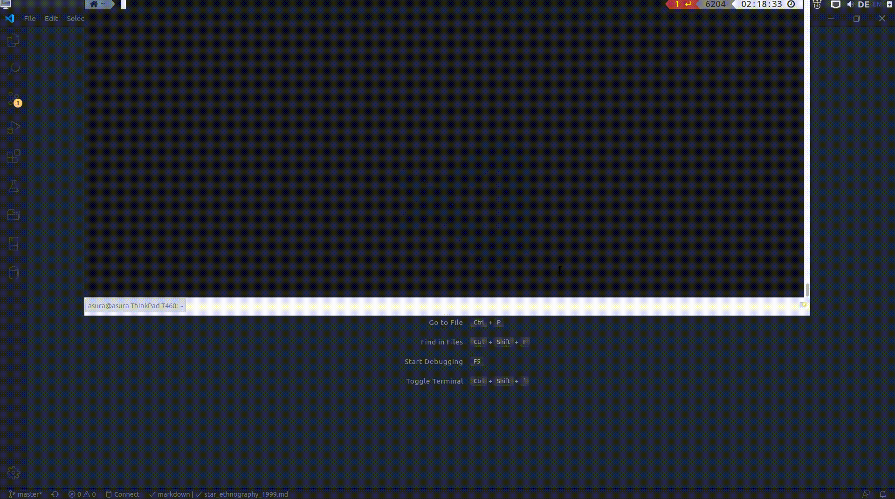

# ZotNote

Automatize and manage your reading notes with Zotero & Better Bibtex Plugin (BBT). **Note: ZotNote is still in early development and not production ready**

[](https://pypi.python.org/pypi/zotnote/)



---

*Current features*

- Simple installation via pipx/pip
- Full command-line interface to create, edit, and remove notes
- Graphical interface to select a Zotero item
- Support for various reading note templates

*Planned features*

- Annotation of reading notes and individual quotes using tags/keywords
  - Retrieval of relevant quotes based on these tags and keywords
  - Analytics based on these tags and keywords
- Enrich reading notes with more metadata from Zotero
- Simple reports about progress of literature review
- (*dreaming*) Automatically export collection of notes as an annotated bibliography.

*Long-term vision*

A literature review suite that connects to Zotero & BBT. Management of reading notes, reading/writing analytics, and basic qualitative text analysis (export reports as HTML via Jupyter notebooks). Export of reading notes in different formats (e.g., annotated bibliography).

You can find a roadmap for ZotNote [here](https://github.com/Bubblbu/zotnote/issues/7).

## Installation

### Requirements

- [Python](https://www.python.org/downloads/) 3.6 or higher
- [Zotero Standalone](https://www.zotero.org/) with [Better Bibtex plugin](https://github.com/retorquere/zotero-better-bibtex)

### Recommended: Install via pipx

The recommended way to install ZotNote is using [pipx](https://pipxproject.github.io/pipx/). Pipx cleanly install the package in an isolated environment (clean uninstalls!) and automagically exposes the CLI-endpoints globally on your system.

    pipx install zotnote

### Option 2: Install via pip

However, you can also simply use pip. Please be aware of the Python version and environments you are using.

    pip install zotnote

### Option 3: Download from GitHub

Download the latest release from Github and unzip. Put the folder containing the scripts into your `PATH`.

Alternatively, run


    [sudo] python3 setup.py install

or

    python3 setup.py install --user

### Option 4: Git clone (for developers)

    git clone git@github.com:Bubblbu/zotnote.git

The project is being developed with [Poetry](https://python-poetry.org/) as a dependency manager.

More instructions will follow soon!

## Getting started

```
Usage: zotnote [OPTIONS] COMMAND [ARGS]...

  CLI for ZotNote.

Options:
  --help  Show this message and exit.

Commands:
  add        Create a new note.
  config     Configure Zotnote from the command line.
  edit       Open a note in your editor of choice.
  remove     Remove a note
  templates  List all available templates for notes.
```

### Configuration

After installation you should be able to simply run `zotnote` and be prompted to a quick command-line configuration.

ZotNote currently asks you for:

- A name which is used in all reading notes.
- An email address
- A folder to store your reading notes

### Usage

Some basic use cases:

Create a note with the graphical interface (Zotero picker)

    zotnote add

Create for specific citekey

    zotnote add [citekey]

Edit a note (with graphical picker)

    zotnote edit

or

    zotnote edit [citekey]

You can explore each command in detail by adding `--help`.

## Authors

Written by [Asura Enkhbayar](https://twitter.com/bubblbu_) while he was quarantined.
